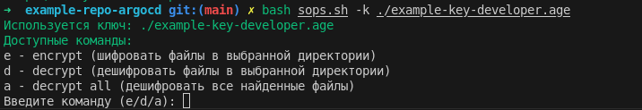
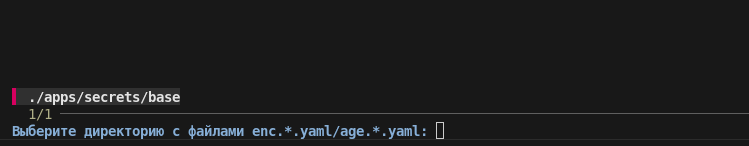
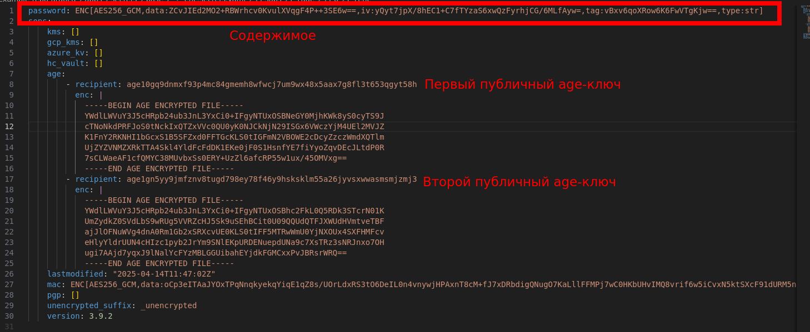

- [Зависимости](#зависимости)
- [Первым делом](#первым-делом)
- [Настройка argocd](#настройка-argocd)
  - [Подробный пример настройки argocd](#подробный-пример-настройки-argocd)
- [Приступаем к работе](#приступаем-к-работе)
  - [Создание нового секрета и шифрование](#создание-нового-секрета-и-шифрование)
  - [Расшифровка секретов](#расшифровка-секретов)

### Зависимости

sops, age и fzf.

### Первым делом

1. Установить под свой дистрибутив https://github.com/FiloSottile/age
2. Сгенерировать age ключ для argocd, этим ключом арго будет расшифровывать секреты
```bash
age-keygen -o example-key-argocd.age
```
3. Сгенерировать личный age ключ, этим ключом будет пользоваться разработчик при локальной работе с секретами
```bash
age-keygen -o example-key-developer.age
```
4. Положить **публичные** части ключей в файл .sops.yaml
```yaml
creation_rules:
  - path_regex: '(age|enc).*\.yaml$'
    key_groups:
      - age:
        - 'age10gq9dnmxf93p4mc84gmemh8wfwcj7um9wx48x5aax7g8fl3t653qgyt58h' # argo
        - 'age1gn5yy9jmfznv8tugd798ey78f46y9hsksklm55a26jyvsxwwasmsmjzmj3' # developer
```
5. В неймспейс с argocd нужно применить ресурс со сгенерированным из п.2 age файлом
```yaml
apiVersion: v1
stringData:
  age-key.txt: |
    # created: 2024-09-05T09:30:53+10:00
    # public key: age-PUBLIC-KEY
    AGE-SECRET-KEY-XXX
kind: Secret
metadata:
  name: sops-age-key
  namespace: argocd
type: Opaque
```

Далее этот ключ будет использоваться argocd для расшифровки.

### Настройка argocd

1. На арго нужно применить patch со следущим содержимым:

```yaml
apiVersion: apps/v1
kind: Deployment
metadata:
  name: argocd-repo-server
  annotations:
    argocd.argoproj.io/sync-options: Prune=false
    argocd.argoproj.io/compare-options: IgnoreExtraneous
spec:
  template:
    spec:
      volumes:
      - name: sops-age-key
        secret:
          defaultMode: 420
          secretName: sops-age-key
      - name: cmp-tmp-sops-age
        emptyDir: {}
      - name: sops-age-plugin
        configMap:
          name: argocd-vault-plugins
          items:
          - key: sops-age-plugin.yaml
            path: plugin.yaml
            mode: 509
      # Mount SA token for Kubernets auth
      # Note: In 2.4.0 onward, there is a dedicated SA for repo-server (not default)
      # Note: This is not fully supported for Kubernetes < v1.19
      automountServiceAccountToken: true
      containers:
      - name: sops-age-plugin
        command:
          - /var/run/argocd/argocd-cmp-server
        env:
          - name: SOPS_AGE_KEY_FILE
            value: /var/run/secrets/age-key.txt
        image: 'ghcr.io/byndyusoft/bs--devops-bricks--argocd-sops-age:v0.0.1'
        resources: {}
        securityContext:
          allowPrivilegeEscalation: false
          capabilities:
            drop:
            - ALL
          readOnlyRootFilesystem: true
          runAsNonRoot: true
          seccompProfile:
            type: RuntimeDefault
        volumeMounts:
          - mountPath: /var/run/argocd
            name: var-files
          - mountPath: /home/argocd/cmp-server/config
            name: sops-age-plugin
          - mountPath: /home/argocd/cmp-server/plugins
            name: plugins
          - mountPath: /tmp
            name: cmp-tmp-sops-age
          - mountPath: /var/run/secrets
            name: sops-age-key
            readOnly: true
```
2. Так же применить CMP-PLUGIN с таким содержимым:
```yaml
apiVersion: v1
kind: ConfigMap
metadata:
  name: argocd-vault-plugins
data:
  sops-age-plugin.yaml: |
    ---
    apiVersion: argoproj.io/v1alpha1
    kind: ConfigManagementPlugin
    metadata:
      name: argocd-vault-plugin-kustomize
    spec:
      allowConcurrency: true

      # Note: this command is run _before_ anything is done, therefore the logic is to check
      # if this looks like a Kustomize bundle
      discover:
        find:
          command:
            - find
            - "."
            - -not
            - -path
            - "*/bootstrap/*"
            - -name
            - kustomization.yaml
      generate:
        command:
          - bash
          - "-o"
          - "pipefail"
          - "-c"
          - |
            AVP_TYPE=sops
            if [ -f "kustomization.yaml" ]; then
              kustomize build --enable-helm --enable-alpha-plugins --load-restrictor=LoadRestrictionsNone . | AVP_TYPE=sops argocd-vault-plugin generate --verbose-sensitive-output -
            else
              # Если kustomization.yaml не найден, выводим yaml файлы с разделителем
              first=true
              for file in *.yaml; do
                if [ -f "$file" ]; then
                  if [ "$first" = true ]; then
                    first=false
                  else
                    echo "---"
                  fi
                  cat "$file"
                fi
              done
            fi
      lockRepo: false
---
```
3. Добавить rbac
```yaml
apiVersion: rbac.authorization.k8s.io/v1
kind: ClusterRole
metadata:
  name: argocd-repo-server
rules:
  - apiGroups:
      - ""
    resources:
      - secrets
    verbs:
      - get
      - watch
---
apiVersion: rbac.authorization.k8s.io/v1
kind: ClusterRoleBinding
metadata:
  name: argocd-repo-server
subjects:
  - kind: ServiceAccount
    name: argocd-repo-server
    namespace: argocd
roleRef:
  apiGroup: rbac.authorization.k8s.io
  kind: ClusterRole
  name: argocd-repo-server
```

#### Подробный пример настройки argocd

[тут](./bootstrap/argo-cd/)

### Приступаем к работе

#### Создание нового секрета и шифрование

1. Если нам нужно задеплоить какой-нибудь ресурс с чуствительной информацией, возле kustomization.yaml файл нам необходимо создать файл [age.secrets.yaml](./apps/secrets/base/age.secrets.yaml).

2. Далее в ресурсах с чувствительными данными необходимо проставить аннотацию `avp.kubernetes.io/path: "../../base/enc.secrets.yaml"` В значении аннотации должен быть **относительный kustomization.yaml** путь до файла.

3. В месте ресурса где будут чувстиветльные данные необходимо указать путь досекрета в файле `password: <password>`

Полный пример - [super-secrets.yaml](./apps/secrets/base/super-secrets.yaml)

4. Далее файл нужно зашифровать `bash sops.sh -k ./example-key-developer.age`
   1. Выбираем опцию e (encrypt) и жмём enter 
   2. После этого скрипт сам найдёт дерикторию где содержатся файлы age.* и интерактивно предложит их выбрать 
5. Появится файл enc.secrets.yaml в котором лежат наши секреты в зашифрованном виде 

#### Расшифровка секретов

1. Запускаем `bash sops.sh -k ./example-key-developer.age` и выбираем опцию d или a(для расшифровки всех зашифрованных файлов). В первом варианте так же появится интерактивное окно с fzf.